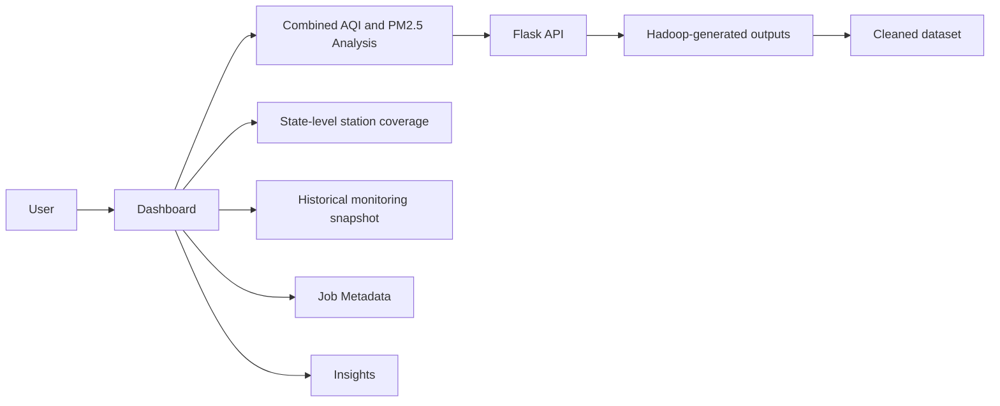
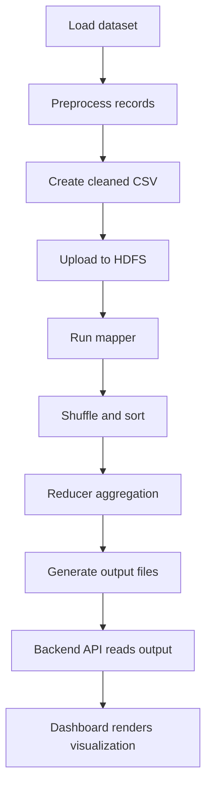
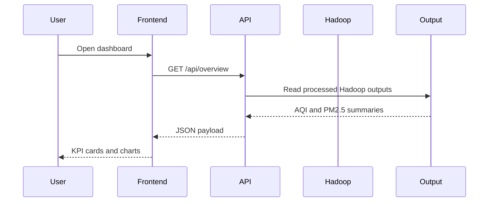

# Air Quality Big Data Analytics Platform

## 1. System Architecture Diagram

```text
RAW DATA
    ↓
PYTHON/PANDAS PREPROCESSING
    ↓
CLEAN DATASET
    ↓
HDFS
    ↓
├───────────────┬───────────────┐
│               │               │
▼               ▼               ▼
MAP JOB 1      MAP JOB 2      DATASET
  ↓               ↓
SHUFFLE + SORT  SHUFFLE + SORT
  ↓               ↓
REDUCER 1       REDUCER 2
  ↓               ↓
AQI ANALYTICS   PM2.5 ANALYTICS
    └──────────┬──────────┘
               ↓
        BACKEND API
               ↓
         REACT DASHBOARD
               ↓
   VISUALIZATION + INSIGHTS
```

## 2. Data Flow Diagram

```text
air_quality_cleaned.csv
    ↓
Python cleanup and validation
    ↓
Standardized station/date/PM2.5/AQI fields
    ↓
HDFS input: /airquality/input/air_quality_cleaned.csv
    ↓
Mapper: (date, AQI_Bucket) and (StationId, PM2.5)
    ↓
Shuffle + Sort
    ↓
Reducer: COUNT and AVG
    ↓
output_aqi_bucket.txt and output_avg_pm25.txt
    ↓
Flask API reads processed outputs
    ↓
Dashboard charts and KPI cards
```

## 3. Use Case Diagram



## 4. Activity Diagram



## 5. Sequence Diagram



## 6. MapReduce Workflow Diagram

```text
Input CSV
   ↓
Mapper 1: key=(date, AQI_Bucket) value=1
   ↓
Shuffle + Sort
   ↓
Reducer 1: COUNT per date/category
   ↓
output_aqi_bucket.txt

Input CSV
   ↓
Mapper 2: key=StationId value=PM2.5
   ↓
Shuffle + Sort
   ↓
Reducer 2: AVG(PM2.5) per station
   ↓
output_avg_pm25.txt
```

## 7. Actual Project Facts

- Dataset: India Air Quality Data
- Records: 1,880,106
- Stations: 107
- Days analyzed: 2,009
- AQI categories: Moderate, Satisfactory, Very Poor, Poor, Good, Severe
- PM2.5 range: 0.01 to 1000.0 µg/m³
- Hadoop output files: output_aqi_bucket.txt, output_avg_pm25.txt
- Geographic validation: the cleaned dataset and station metadata do not contain reliable latitude/longitude values. No fake coordinates are used.
